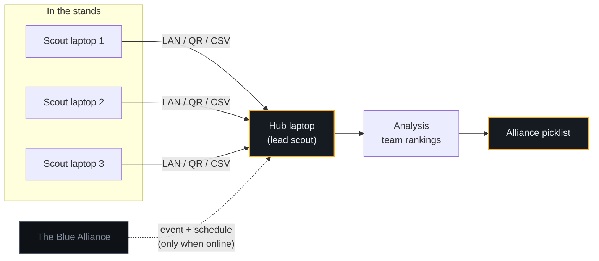

<div align="center">


[](https://github.com/rishanreddy/matchbook/releases/latest)
[](#installation)
[](#why-offline-matters)
[](LICENSE)

**Scout every match, then turn what you saw into a picklist — without needing the venue Wi-Fi.**

</div>

---

## What it is

Competition halls do not have usable internet. Matchbook assumes that from the start: every
laptop keeps a complete local database, and data moves between them over your own LAN, a QR
code, or a USB stick. Nothing needs a network to work.

One laptop is the **hub** — it holds the event, the scouting form, and the combined data. The
rest are **scout** laptops, each recording one robot at a time. At the end of a match block you
pull everything back to the hub and rank teams for alliance selection.

<div align="center">

</div>

---

## How data moves



The only step that ever touches the internet is importing an event from The Blue Alliance, and
you can do that at home the night before. Everything after that is local.

---

## At a glance

| | |
|---|---|
| **Current release** | v2.1.2 |
| **Platforms** | Windows (x64), macOS (Apple Silicon), Linux (x64) |
| **Screens** | 11 — Home, Scout, Events, Analysis, Sync, Assignments, Form Builder, Device Setup, Settings, Help, Developer Tools |
| **Sync transports** | 4 — LAN, QR code, CSV, full database snapshot |
| **Collections synced** | 6 — scouting data, form schemas, analysis configs, events, matches, assignments |
| **Local storage** | RxDB on IndexedDB — survives restarts, no server |
| **Built with** | Electron 41 · React 19 · TypeScript · Mantine · RxDB |
| **Tests** | 31 passing across 3 suites |
| **Source** | ~19,000 lines across 83 TypeScript files |

---

## Installation

Grab the installer for your platform from the
**[latest release](https://github.com/rishanreddy/matchbook/releases/latest)**.

| Platform | File | Size |
|---|---|---|
| Windows 10/11 (x64) | `Matchbook-2.1.2-Setup.exe` | 140 MB |
| macOS (Apple Silicon) | `Matchbook-2.1.2-arm64.dmg` | 175 MB |
| Linux (x64) | `Matchbook-2.1.2.AppImage` | 184 MB |

### Windows

1. Download `Matchbook-2.1.2-Setup.exe`.
2. Run it. SmartScreen may say *"Windows protected your PC"* — click **More info → Run anyway**.
3. Pick an install location and finish. A desktop shortcut is created for you.

### macOS — extra step required

> [!IMPORTANT]
> Matchbook is not notarized by Apple, so macOS will refuse to open it and claim the app is
> **"damaged"**. The app is fine — this is Gatekeeper reacting to the missing Apple signature.
> One command clears it.

1. Download `Matchbook-2.1.2-arm64.dmg` and open it.
2. Drag **Matchbook** into your **Applications** folder.
3. Open **Terminal** (⌘-Space, type `Terminal`, press Return) and run:

   ```bash
   xattr -dr com.apple.quarantine /Applications/Matchbook.app
   ```

4. Open Matchbook normally from Applications. You only do this once per install.

<details>
<summary><strong>What that command actually does</strong></summary>

<br>

macOS tags everything downloaded from the internet with a `com.apple.quarantine` attribute.
When you open a quarantined app, Gatekeeper checks it for an Apple Developer ID signature and a
notarization ticket. Matchbook has neither, so macOS blocks it and reports it as damaged — the
wording is misleading, nothing is actually corrupt.

`xattr -dr com.apple.quarantine` deletes (`-d`) that attribute recursively (`-r`) from the app
bundle, so Gatekeeper stops treating it as freshly downloaded.

Only run this on software you trust and downloaded yourself. If you would rather verify the
download first, compare it against the `sha512` in `latest-mac.yml` on the release page.

Right-clicking and choosing **Open** — the usual advice for unsigned apps — does **not** work
here, because the build is ad-hoc signed rather than unsigned. The Terminal command is the way.

</details>

> [!NOTE]
> Two consequences of the missing signature on macOS: **in-app updates do not work**, so Mac
> users download each new release by hand and repeat the `xattr` step. And the release is
> **Apple Silicon only** — there is no Intel build, so Intel Macs need the Windows or Linux
> version. Windows and Linux both auto-update normally.

### Linux

1. Download `Matchbook-2.1.2.AppImage`.
2. Make it executable and run it:

   ```bash
   chmod +x Matchbook-2.1.2.AppImage
   ./Matchbook-2.1.2.AppImage
   ```

---

## Getting started

Do this at home, the night before, while you still have internet:

**1. Set up the hub laptop**

- Open **Settings** and paste in your
  [TBA API key](https://www.thebluealliance.com/account) (free).
- In **Device Setup**, register the laptop as **Hub**.
- Go to **Events** and import your competition.

**2. Build your scouting form**

Open **Form Builder** and add the questions your team cares about.

> [!IMPORTANT]
> Question **names** decide how a match is scored. Matchbook cannot know what a given game
> awards points for, so it buckets each answer by the start of its name:
>
> | Name starts with | Counted toward |
> |---|---|
> | `auto…` | Autonomous |
> | `teleop…` | Teleop |
> | `endgame…` or `climb…` | Endgame |
>
> Numbers count as their value, checkboxes count as 1, and free text is collected but not
> scored. A form full of questions named `q1`, `q2` will produce a ranking where every team
> ties at zero — Analysis warns you when that happens.

<div align="center">

</div>

**3. Set up the scout laptops**

- Register each as **Scout** in Device Setup — each gets its own name, so the hub can tell
  them apart.
- Send them the form from **Sync**. Scout laptops never need a TBA key.

**4. At the event**

Scouts record matches. Between match blocks, bring the data back to the hub via **Sync**, then
open **Analysis** to compare teams and build your picklist.

<div align="center">

</div>

---

## Moving data between laptops

<div align="center">

</div>

| Method | Use it when | Notes |
|---|---|---|
| **LAN** | You have a router or hotspot of your own | Fastest. Hub runs a local server; scouts upload to its IP. Token-protected, private addresses only. |
| **QR code** | No network at all | Scout shows a code, hub scans it. Good for a handful of matches. |
| **CSV** | You want the raw data | Export/import via USB. Also how you get data into a spreadsheet. |
| **Database snapshot** | Setting up a new laptop, or making a backup | Copies everything at once. |

### Why offline matters

Venue Wi-Fi is congested, locked down, or absent, and the field network is off-limits. Matchbook
never assumes a connection: fonts are bundled rather than fetched, update checks fail silently
instead of throwing errors at you mid-match, and the LAN sync only ever talks to private
addresses on your own network.

---

## Development

```bash
pnpm install
pnpm dev              # run the app with hot reload
pnpm test             # unit tests
pnpm verify:production # tests + typecheck + lint + build — the release gate
pnpm build:mac        # or build:win / build:linux
```

<details>
<summary><strong>Shipping an update</strong></summary>

<br>

Installed copies check GitHub on launch and show a banner when a new release exists. Downloads
are never automatic — a laptop on a shared venue hotspot is not dragged into a 150 MB transfer
mid-event.

1. Bump `version` in `package.json` and commit.
2. Tag and push: `git tag v2.1.3 && git push origin v2.1.3`. The tag must match the
   `package.json` version or the workflow stops before building anything.
3. GitHub Actions runs the release gate, builds all three platforms, verifies the artifacts, and
   publishes.

Before publishing, CI checks that each `latest-*.yml` update manifest matches the bytes of the
artifacts beside it. A manifest left over from an earlier build would otherwise ship a checksum
that no longer matches, and every client would download the update and then reject it. Local
packaging wipes `release/` first for the same reason.

**To enable macOS signing** (which also enables macOS auto-update and removes the `xattr` step
for your users), add these repository secrets: `MAC_CERTIFICATE`, `MAC_CERTIFICATE_PASSWORD`,
`APPLE_ID`, `APPLE_APP_SPECIFIC_PASSWORD`, `APPLE_TEAM_ID`. They require a paid Apple Developer
account. Without them the workflow still ships a working `.dmg` and logs a warning.

</details>

<details>
<summary><strong>Project layout</strong></summary>

<br>

```
src/
  main/        Electron main process — window, updater, LAN sync server
  preload/     Context bridge (sandboxed, CommonJS)
  renderer/    React app
    routes/    One file per screen
    lib/db/    RxDB schemas and collections
    lib/utils/ Scoring, analysis config, sync helpers
  shared/      Types and the sync protocol, used by both processes
build/logo/    Vector source for the app mark — see its README to regenerate icons
```

</details>

---

## Acknowledgments

Inspired in part by resources from [Lovat](https://learn.lovat.app/guides/welcome), which helped
shape early ideas for Matchbook.

## Contributing

Pull requests welcome. For anything substantial, open an issue first.

## License

MIT — see [LICENSE](LICENSE).
