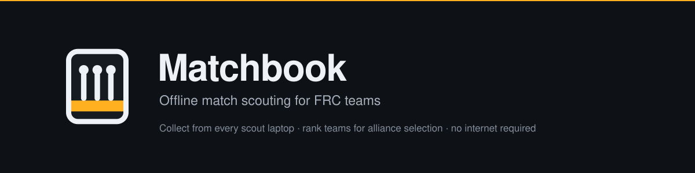
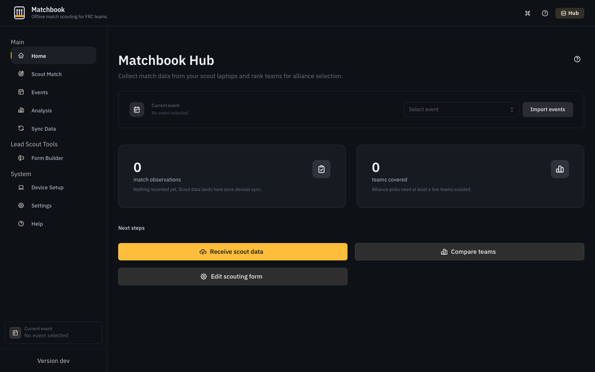
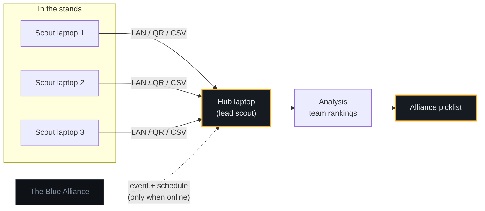
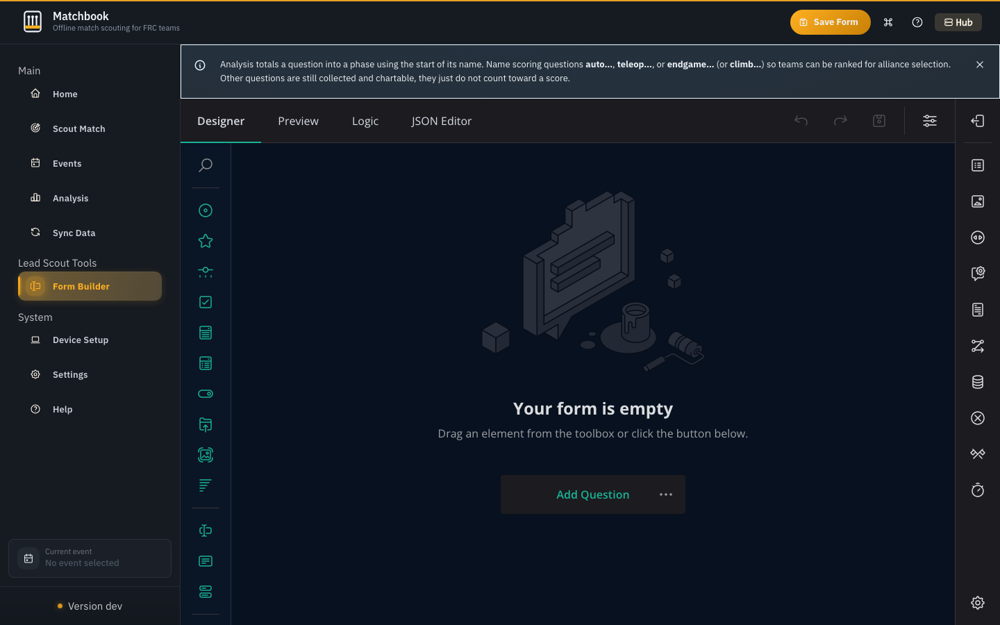
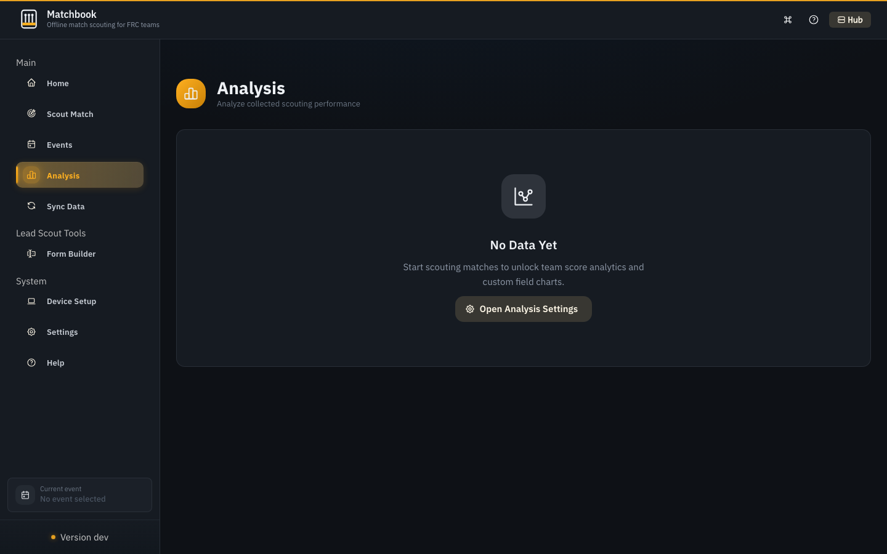
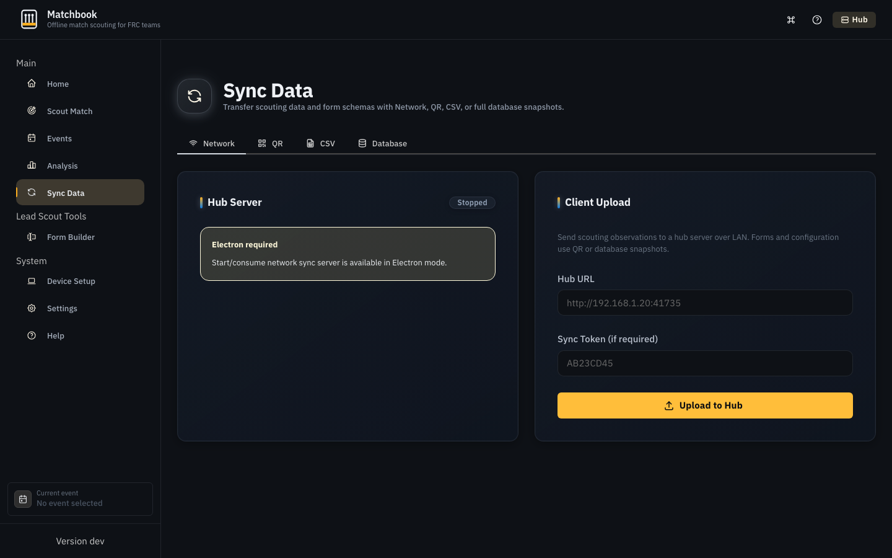

<p align="center">
  
</p>

<p align="center">
  <a href="https://github.com/rishanreddy/matchbook/releases/latest"></a>
  <a href="https://github.com/rishanreddy/matchbook/releases"></a>
  <a href="https://github.com/rishanreddy/matchbook/actions/workflows/release.yml"></a>
  <a href="LICENSE"></a>
</p>

<p align="center">
  <a href="#installation">Installation</a> &nbsp;&bull;&nbsp;
  <a href="#getting-started">Getting started</a> &nbsp;&bull;&nbsp;
  <a href="#moving-data-between-laptops">Sync</a> &nbsp;&bull;&nbsp;
  <a href="#when-matchbook-is-the-wrong-tool">When not to use it</a> &nbsp;&bull;&nbsp;
  <a href="#development">Development</a>
</p>

Matchbook is a desktop scouting app for FIRST Robotics Competition teams. Your scouts
record what each robot does during a match, the data comes back to one laptop, and that
laptop ranks teams so you can build an alliance picklist.

It runs with no internet. Competition halls rarely have usable Wi-Fi, and the field
network is off limits, so every laptop keeps its own complete database and data moves
between them over your own LAN, a QR code, or a USB stick.

<p align="center">
  
</p>

## How data moves

One laptop is the hub. It holds the event, the scouting form, and the combined data.
Every other laptop is a scout, recording one robot at a time.



Importing an event from The Blue Alliance is the only step that ever touches the
internet, and you can do that at home the night before. Everything after that is local.

## Installation

Download from the [latest release](https://github.com/rishanreddy/matchbook/releases/latest).
Windows gets a `.exe` installer, macOS a `.dmg`, Linux an `.AppImage`.

### Windows

Run the installer. SmartScreen will probably say "Windows protected your PC", because
the installer is not signed. Click "More info", then "Run anyway".

### macOS

macOS needs one extra command, and the app will not open without it.

> [!IMPORTANT]
> macOS will tell you Matchbook is **damaged and should be moved to the Trash**. It is
> not damaged. Matchbook has no Apple Developer ID signature, and that is the error
> Gatekeeper shows for unsigned software you downloaded.

1. Open the `.dmg` and drag Matchbook into your Applications folder.
2. Open Terminal. Press Command and Space, type `Terminal`, press Return.
3. Run this, then open the app normally:

```bash
xattr -dr com.apple.quarantine /Applications/Matchbook.app
```

You do this once per install, not once per launch.

<details>
<summary>What that command does, and why it is needed</summary>

<br>

macOS tags every file you download with an attribute called `com.apple.quarantine`.
When you open a quarantined app, Gatekeeper looks for an Apple Developer ID signature
and a notarization ticket from Apple. Matchbook has neither, so macOS refuses to run it
and reports it as damaged. The wording is wrong. Nothing about the download is corrupt.

`xattr -dr com.apple.quarantine` deletes that attribute from the app, recursively, so
Gatekeeper stops treating the app as freshly downloaded.

Run this only on software you trust and downloaded yourself. If you want to check the
download first, each release ships a `latest-mac.yml` containing the `sha512` of every
file, so you can compare before you clear the flag.

Right-clicking the app and choosing Open is the usual advice for unsigned software. It
does not work here, because these builds are ad-hoc signed rather than unsigned, and
macOS gives that case no bypass in the interface. The Terminal command is the only way.

</details>

> [!NOTE]
> Two things follow from the missing signature. Matchbook cannot update itself on
> macOS, so Mac users download each new release by hand and repeat the command above.
> And the macOS build is Apple Silicon only. An Intel Mac cannot run it, so use a
> Windows or Linux laptop instead. Windows and Linux both update themselves normally.

### Linux

```bash
chmod +x Matchbook-*.AppImage
./Matchbook-*.AppImage
```

## Getting started

Do all of this at home the night before, while you still have internet.

**Set up the hub laptop.** Open Settings and paste in a
[TBA API key](https://www.thebluealliance.com/account), which is free. Open Device Setup
and register the laptop as a hub. Open Events and import your competition.

**Build your scouting form.** Open Form Builder and add the questions your team cares
about. Question names decide how a match gets scored, so read the box below before you
name anything.

> [!IMPORTANT]
> Matchbook cannot know what a game awards points for, so it sorts each answer into a
> phase by the start of the question's name.
>
> | Name starts with | Counts toward |
> |---|---|
> | `auto` | Autonomous |
> | `teleop` | Teleop |
> | `endgame` or `climb` | Endgame |
>
> Numbers count as their value and checkboxes count as 1. Free text is stored but never
> scored. Name your questions `q1` and `q2` and every team will tie at zero, which
> makes the picklist useless. Analysis warns you when that happens.

<p align="center">
  
</p>

**Set up the scout laptops.** Register each one as a scout in Device Setup. Each gets
its own name so the hub can tell them apart. Send them the form from Sync. Scout
laptops never need a TBA key.

**At the event.** Scouts record matches. Between match blocks you pull the data back to
the hub through Sync, then open Analysis to compare teams.

<p align="center">
  
</p>

### What each screen is for

<!-- generated:screens -->
| Screen | Shown on | What it does |
|---|---|---|
| Analysis | Hub | Compare teams and build a picklist |
| Assignments | Hub | Decide which scout covers which match |
| Developer Tools | Developer | Database inspection, hidden unless developer mode is on |
| Device Setup | Both | Name this laptop and set it as hub or scout |
| Event Management | Hub | Import events and schedules from The Blue Alliance |
| Form Builder | Hub | Build the questions your scouts answer |
| Help | Both | In-app guidance |
| Home | Both | Event selection and what to do next |
| Scout | Both | Record one robot for one match |
| Settings | Both | TBA key, shortcuts, updates |
| Sync | Both | Move data between laptops |
<!-- /generated:screens -->

## Moving data between laptops

<p align="center">
  
</p>

| Method | Use it when | Notes |
|---|---|---|
| LAN | You brought your own router or hotspot | Fastest. The hub runs a local server and scouts upload to its address. Protected by a token, and it only talks to private addresses. |
| QR code | There is no network at all | The scout shows a code, the hub scans it. Fine for a handful of matches, slow for a full day. |
| CSV | You want the raw rows | Export to a USB stick. Also how you get the data into a spreadsheet. |
| Database snapshot | Setting up a new laptop, or taking a backup | Copies everything at once. |

Sync covers <!-- generated:collections -->
`scouting data`, `form schemas`, `analysis configs`, `events`, `matches`, `assignments`
<!-- /generated:collections --> so a scout laptop that has never seen the internet still
ends up with the right form and schedule.

## When Matchbook is the wrong tool

Worth knowing before your team commits to it.

**You need pit scouting or photos.** Matchbook records match performance. There is no
pit interview form and no image capture.

**Your scouts use phones or tablets.** This is a desktop app for Windows, macOS, and
Linux. There is no mobile build, and no browser version.

**You compete in FTC.** Matchbook reads The Blue Alliance, which only covers FRC. FTC
events use a different API entirely.

**You want official game scores.** Matchbook counts what your scouts recorded. It does
not implement any year's scoring rules, so its numbers rank teams against each other
rather than reproducing the scoreboard.

**Everyone on your team has an Intel Mac.** The macOS build is Apple Silicon only.

## Development

```bash
pnpm install
pnpm dev                # run with hot reload
pnpm test               # unit tests
pnpm verify:production  # tests, typecheck, lint, build. The release gate.
pnpm build:mac          # or build:win, build:linux
pnpm docs:sync          # regenerate the tables in this README from the source
```

Built with <!-- generated:stack -->
Electron 41, React 19, TypeScript 5, RxDB 16, Mantine, Vite
<!-- /generated:stack -->.

<details>
<summary>Project layout</summary>

<br>

```
src/
  main/        Electron main process. Window, updater, LAN sync server.
  preload/     Context bridge. Sandboxed, CommonJS.
  renderer/    The React app.
    routes/    One file per screen.
    lib/db/    RxDB schemas and collections.
    lib/utils/ Scoring, analysis config, sync helpers.
  shared/      Types and the sync protocol, used by both processes.
build/logo/    Vector source for the app mark. Its README explains how to regenerate icons.
scripts/       Release artifact checks and the README generator.
```

The tables above are written by `scripts/sync-readme.mjs` from the code itself, so
adding a route or bumping a dependency updates them. CI fails if they drift.

</details>

<details>
<summary>Publishing a release</summary>

<br>

Installed copies check GitHub on launch and show a banner when a new version exists.
Downloads never start on their own, because dragging a laptop on a shared venue hotspot
into a 150 MB transfer mid-event would be a bad way to lose a match.

1. Bump `version` in `package.json` and commit.
2. Tag and push. The tag has to match that version or the workflow stops before it
   builds anything.
3. GitHub Actions runs the release gate, builds all three platforms, checks the
   artifacts, and publishes.

Before publishing, CI confirms that each `latest-*.yml` matches the bytes of the files
beside it. A manifest left over from an earlier build would otherwise ship a checksum
that no longer matches, every client would download the update, and every client would
then reject it. Local packaging wipes `release/` first for the same reason.

To sign the macOS build, which also turns on macOS auto-update and removes the `xattr`
step for your users, add these repository secrets: `MAC_CERTIFICATE`,
`MAC_CERTIFICATE_PASSWORD`, `APPLE_ID`, `APPLE_APP_SPECIFIC_PASSWORD`, `APPLE_TEAM_ID`.
They need a paid Apple Developer account. Without them the workflow still ships a
working `.dmg` and logs a warning.

</details>

## Acknowledgments

Early ideas came from [Lovat](https://learn.lovat.app/guides/welcome).

## Contributing

Pull requests are welcome. Open an issue first for anything large.

## License

MIT. See [LICENSE](LICENSE).
