# How to use Matchbook

<!-- Generated from src/renderer/src/content/guide.json by scripts/sync-guide-docs.mjs. Do not edit by hand. -->

Step-by-step guides for people who have never used Matchbook. The same guide, with
clickable pictures and two short videos, is in the app under **Help**.

## For scouts

### 1. Get the scouting form (once)

The lead scout gives you the questions you will answer.

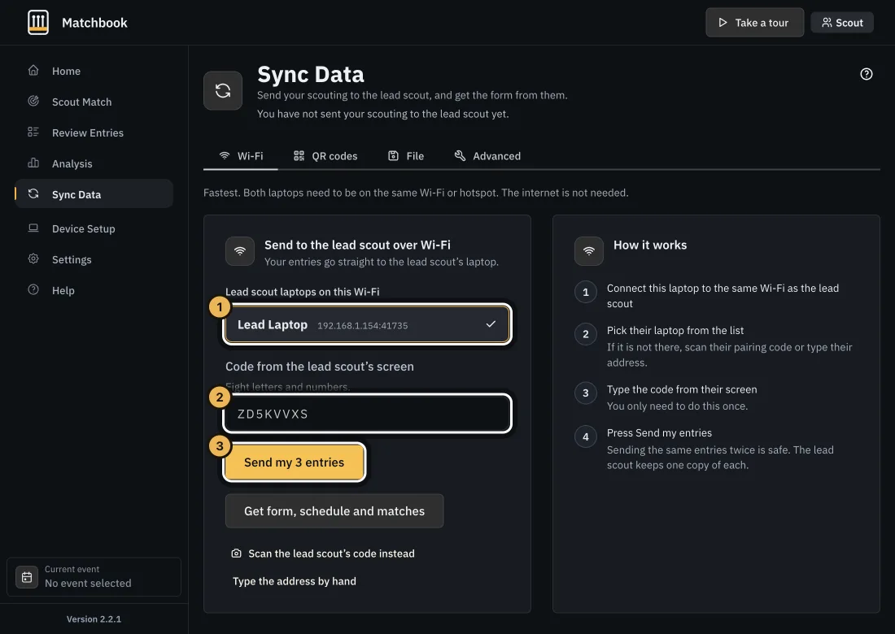
*The Sync Data screen on a scout’s laptop.*

1. Connect this laptop to the same Wi-Fi as the lead scout.
   A phone hotspot works too. The internet is not needed.
2. Open **Sync Data** in the left menu, then choose **Wi-Fi**.
3. Click the lead scout’s laptop in the list.
   Its name is whatever the lead scout called it, like “Lead Laptop”. Not there? See “I can’t find the lead scout’s laptop” further down.
4. Type the 8-letter code from the lead scout’s screen.
   You only need to do this once.
5. Press **Get form, schedule and matches**.
   You will see “Got 1 scouting form…”. You are ready to scout. If you had not picked an event, your laptop starts on the lead scout’s.

> **Tip:** No Wi-Fi at all? Use **QR codes** or **File** instead. They are in the same Sync Data screen.

### 2. See which matches are yours

The lead scout can give you a list of matches to watch.

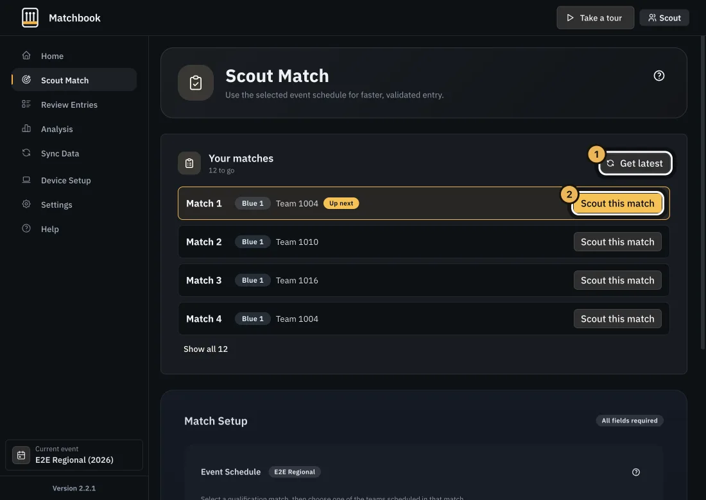
*Your matches shows what the lead scout gave you, with the next one first.*

1. Open **Scout Match** in the left menu.
   If it asks you to pick your event, choose it and press **Use this event**.
2. Press **Get latest** on the **Your matches** card.
   You need the same Wi-Fi as the lead scout, just like when you got the form. With QR codes or a file, use **Get form, schedule and matches** in Sync Data instead.
3. If it asks **Which scout are you?**, press your name.
   These are the names the lead scout added. Not on the list? Type your name in **Device Setup**, then press **Send my entries** so the lead scout sees it.
4. Press **Scout this match** on the match you are about to watch.
   It fills in the match and the team for you. The next match is highlighted.

> **Tip:** Matches you have already scouted show **Done**. If the lead scout changes the plan, press **Get latest** again.

### 3. Scout a match

Pick the match and the team, then answer the questions as it happens.

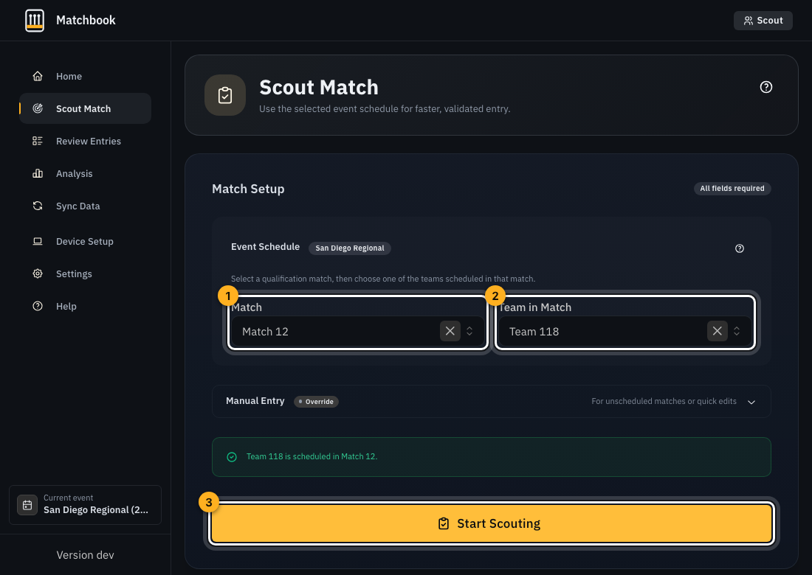
*1. Pick the match. 2. Pick the team. 3. Start Scouting.*

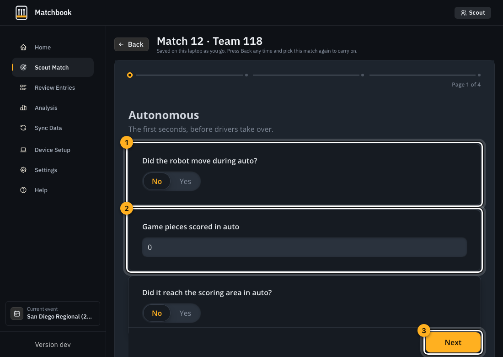
*Answer the questions. Press Next for the next page.*

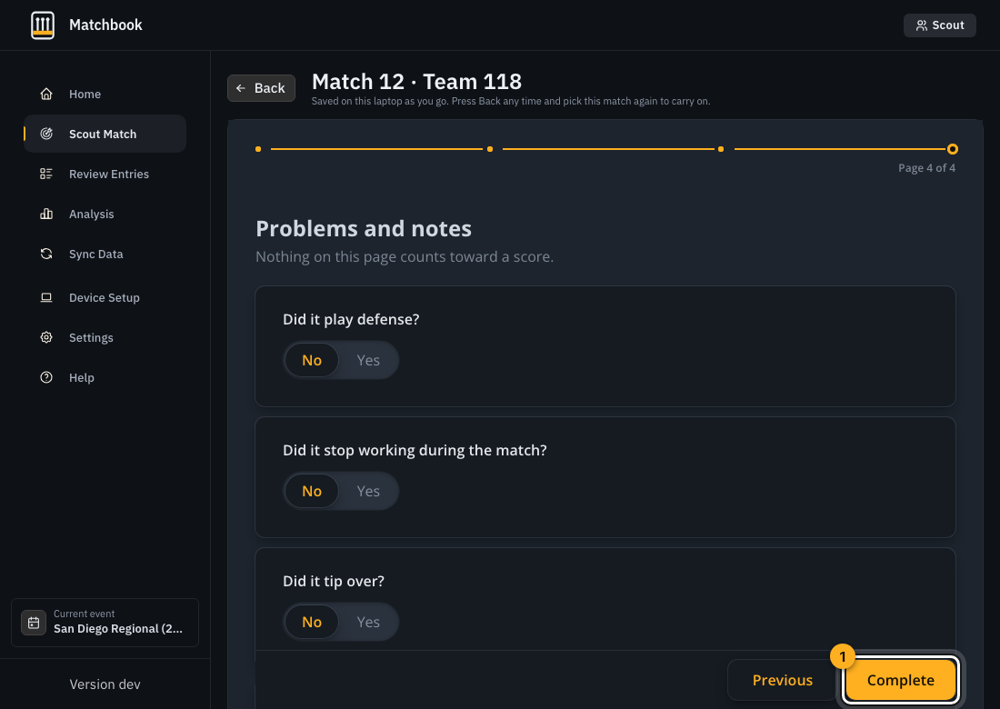
*On the last page, press Complete.*

1. Press **Scout Match** in the left menu, or press **Scout a match** on the Home screen.
2. If it says **Pick your event before you scout**, choose your event and press **Use this event**.
   Entries saved with no event are filed under “No event selected”, and the lead scout will not see them for your event.
3. Pick the **Match**, then the **Team** you are watching.
   The match is not on the list? Open **Manual Entry** and type the numbers instead.
4. Press **Start Scouting**.
5. Answer the questions while you watch.
   Tap **Yes** or **No**, or type a number. There is no rush. Your answers are saved as you go.
6. Press **Next** to go to the next page.
   The **Next** button always stays at the bottom of the window.
7. On the last page, press **Complete**.
   You will see “Saved!”. That entry is now safe on this laptop, even with no Wi-Fi.

> **Tip:** Closed the form by accident? Pick the same match and team again. Your answers are still there.

### 4. Send your scouting to the lead scout

Do this every few matches so nothing piles up.

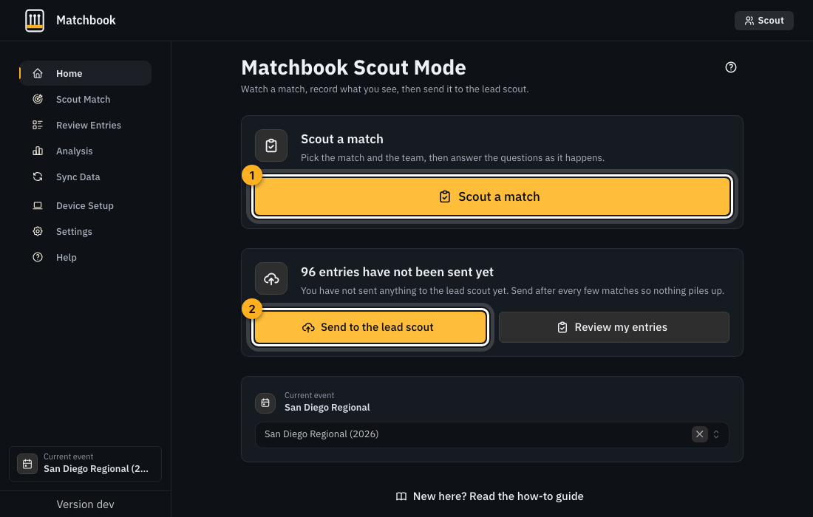
*The Home screen tells you how many entries the lead scout does not have yet.*

1. Make sure you are on the same Wi-Fi as the lead scout, then open **Sync Data** and **Wi-Fi**.
   Or press **Send to the lead scout** on the Home screen.
2. Click the lead scout’s laptop, and type the code if it is not already filled in.
3. Press **Send my entries**.
   You will see “Sent 12 entries to the lead scout”. Sending the same entries again is safe. The lead scout keeps one copy of each. Your name goes with them, so the lead scout can give you matches.

> **Tip:** No Wi-Fi? Use **QR codes** (next section) or **File**. They move exactly the same data.

### 5. Send with QR codes (no Wi-Fi needed)

One laptop shows codes on its screen. The other reads them with its camera.

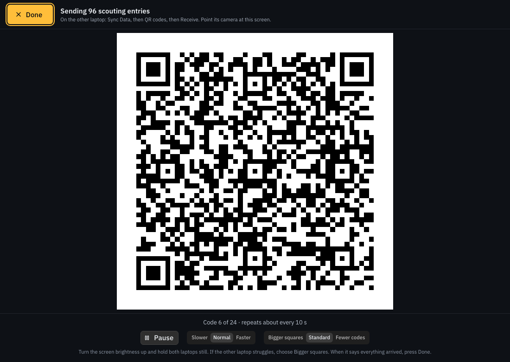
*The sending laptop shows codes.*

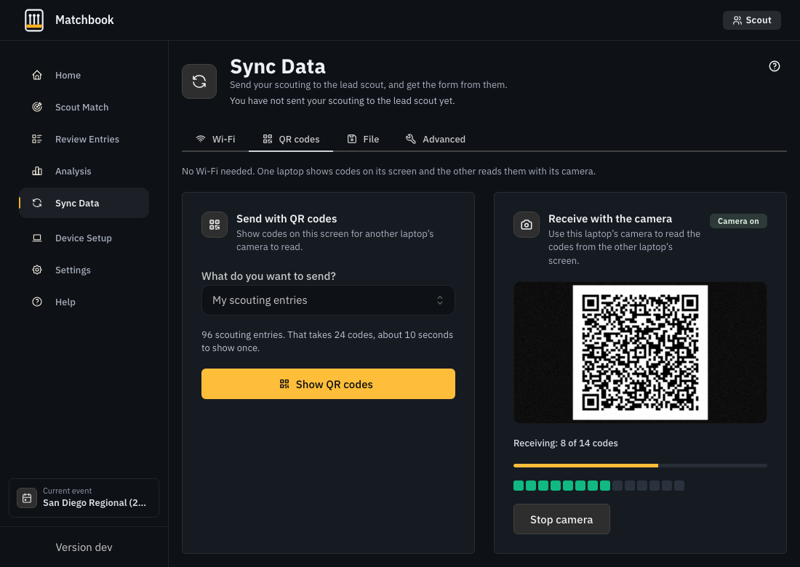
*The receiving laptop reads them with its camera.*

1. On the laptop that is **sending**, open **Sync Data**, then **QR codes**. Choose what to send and press **Show QR codes**.
   Turn the screen brightness up. The screen fills with a code that keeps changing. That is normal.
2. On the laptop that is **receiving**, open **Sync Data**, then **QR codes**, and press **Start camera**.
   Point its camera at the sending screen, about a hand’s width away. Keep both laptops still.
3. Wait for **Everything arrived**.
   The codes repeat, so it does not matter where it starts or if it misses a few. Small squares turn green as it goes.
4. Press **Add to this laptop** on the receiving laptop.
5. On the sending laptop, press **Done**, and answer **Did it arrive?**

> **Tip:** If it will not read, choose **Bigger squares** on the sending screen, move a little closer, and check that neither screen has glare on it.

### 6. Send with a file (USB stick, AirDrop, email)

Save a file, carry it to the other laptop, and open it there.

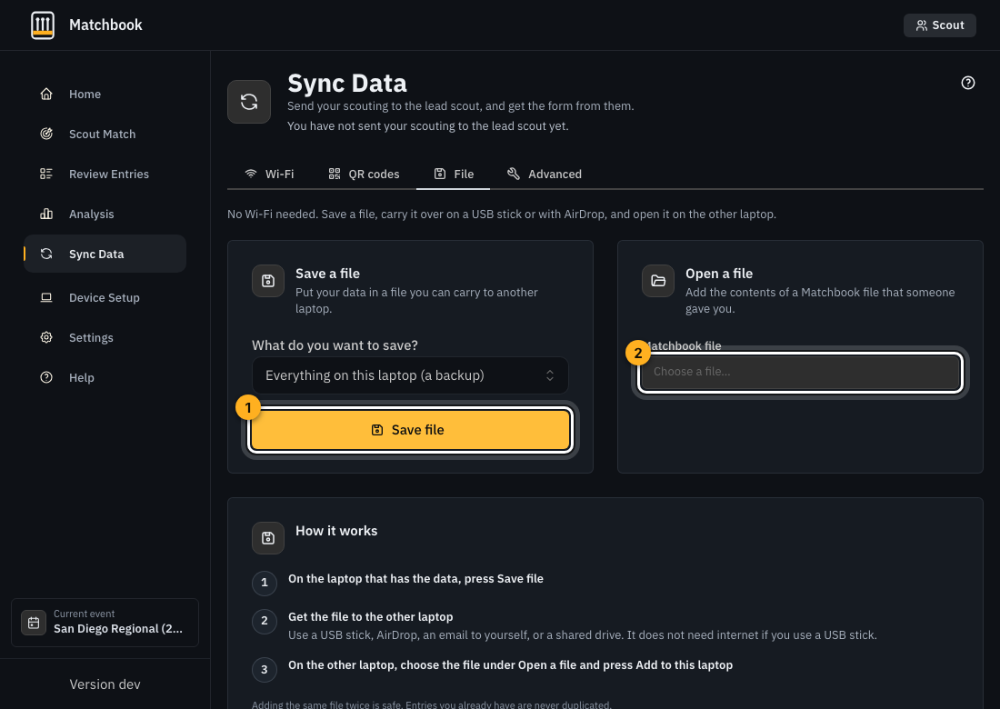
*Save a file on one laptop, open it on the other.*

1. Open **Sync Data**, then **File**.
2. Choose **My scouting entries** and press **Save file**.
3. Get the file to the lead scout.
   A USB stick, AirDrop, an email, or a shared drive all work. A USB stick needs no internet at all.
4. On the lead scout’s laptop: **Sync Data**, **File**, choose the file under **Open a file**, and press **Add to this laptop**.

> **Tip:** A saved file is also the best backup. Save one every few matches and keep it somewhere other than this laptop.

### 7. Fix a mistake

Scouted the wrong team? Remove the entry and scout it again.

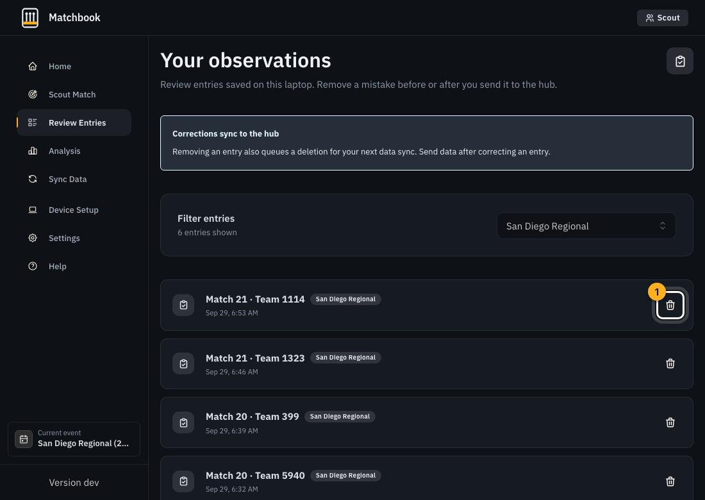
*Press the trash can on the entry you want to remove.*

1. Open **Review Entries** in the left menu.
2. Find the entry. Each row shows the match and the team.
3. Press the trash can on that row, and confirm.
4. Scout the match again, then send your entries.
   The lead scout’s laptop is told about the removal too, so the wrong entry disappears there as well.

> **Tip:** You can only remove entries that were made on your own laptop.

## For the lead scout

### 1. Set up before the event

Do this while you still have internet.

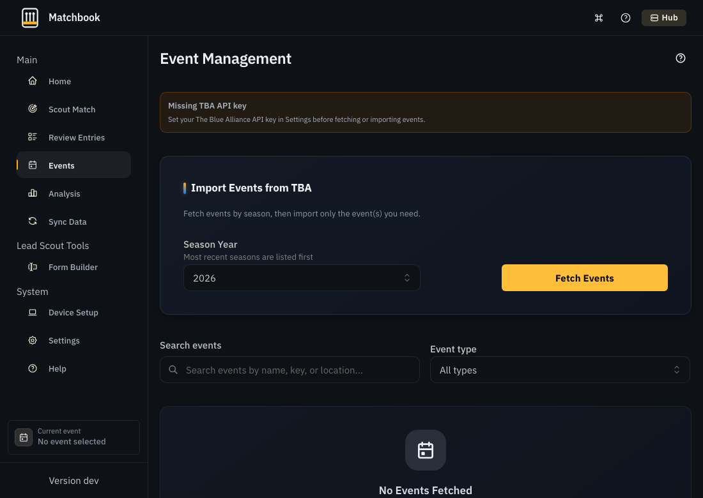
*Events is where you load the match schedule.*

1. Get a free key from The Blue Alliance.
   Go to thebluealliance.com, sign in, open **Account**, and create a **Read API Key**. Copy it.
2. In Matchbook, open **Settings** and paste the key into the Blue Alliance box.
3. Open **Events**, press **Fetch Events**, find your event, and press **Import**.
   This downloads the match schedule. After this, you do not need the internet.
4. On the **Home** screen, choose your event under **Current event**.

> **Tip:** No internet at the event? Do this at school or at home first. Everything after this works with no internet.

### 2. Build the scouting form

The questions every scout will answer for every match.

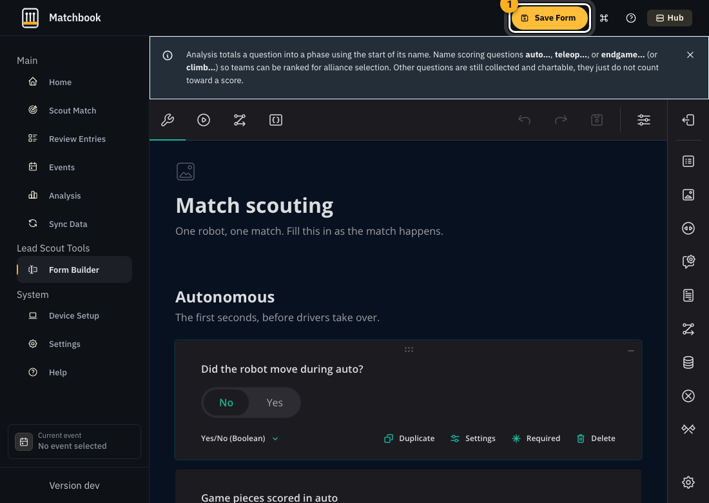
*Press Save Form when you are happy with the questions.*

1. Open **Form Builder**, under Lead Scout Tools.
2. For your first event, press **Use the starter form**.
   It already has pages for Autonomous, Teleop, Endgame, and Problems and notes. You can change, add, or remove any question.
3. Or, to get questions written for this year’s game, press **Build with AI**.
   Copy the prompt into your AI chat while you have internet. It includes SurveyJS references and Matchbook’s analysis rules. Answer the AI’s questions, paste its reply back, and try the questions, conditional logic and calculations in the preview. Preview answers are never saved. Then press **Use this form**.
4. When you are happy, press **Save Form** at the top right.
   This is now the form your scouts will get.

> **Tip:** Analysis can compare any numeric or Yes/No answer. For phase totals, use result keys starting with **auto**, **teleop**, **endgame** or **climb**. Keep penalties and opinions neutral. Save calculated values with **includeIntoResult: true**, and avoid giving both a total and its inputs phase prefixes.

### 3. Collect scouting from the scouts

Scouts send their entries straight to your laptop over Wi-Fi.

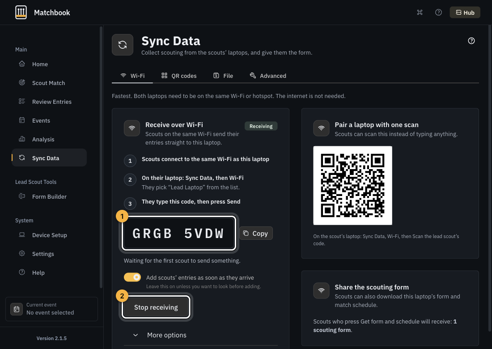
*The code on this screen is what scouts type.*

1. Put your laptop and the scouts’ laptops on the same Wi-Fi.
   A phone hotspot is perfect, and the internet is not needed. Avoid the venue’s public Wi-Fi. It often stops laptops from seeing each other.
2. Open **Sync Data**, then **Wi-Fi**, and press **Start receiving**.
3. Tell the scouts the **code** on your screen.
   Or let them scan the small square code instead of typing.
4. Each scout presses **Get form, schedule and matches** once, and later **Send my entries** every few matches.
5. Their entries appear on your laptop by themselves.
   The **Home** screen keeps count. If a yellow notice says some entries are for a different event, open **Review Entries** and press **Show all events**.

> **Tip:** If Windows asks about the firewall the first time, choose **Allow** for private networks. Without it, scouts cannot reach your laptop.

### 4. Plan who watches which match

Give every robot in every match a scout, fairly, in a few clicks.

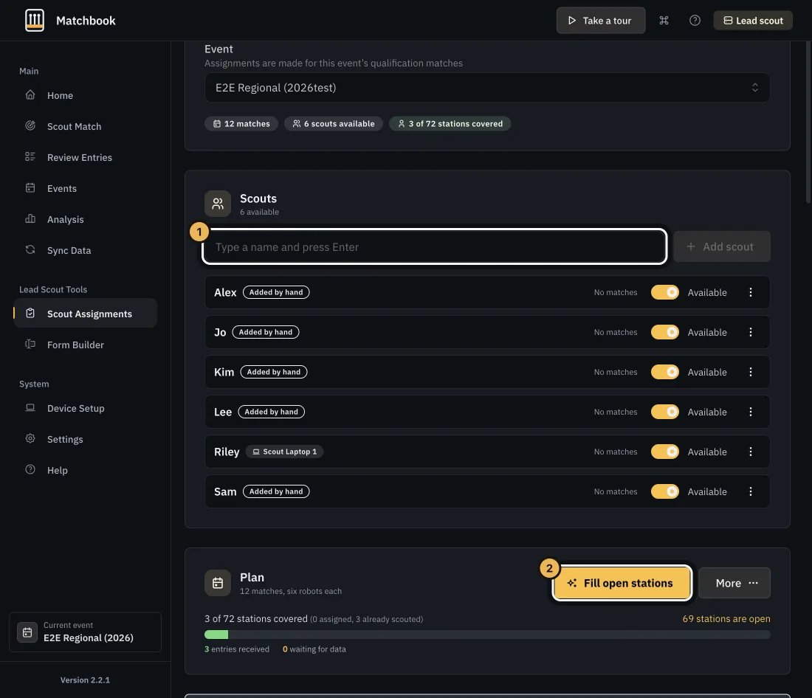
*1. Add your scouts. 2. Press Fill open stations.*

1. Open **Scout Assignments**, under Lead Scout Tools, and check the **Event** at the top.
2. Under **Scouts**, type each scout’s name and press Enter.
   A scout who types their name in **Device Setup** and connects to your laptop is added by themselves. Switch someone to away when they step out. Their matches that nobody has scouted yet can then go to other scouts.
3. Press **Fill open stations**, read the summary, then press **Assign**.
   Every match gets up to six scouts, spread evenly. A scout keeps the same robot position when they can. With fewer than six scouts, the robots watched least so far come first.
4. Watch the bar fill as scouts send their entries.
   Green is data that has arrived. Amber is waiting for data. A station is late when later matches have arrived without it.
5. Change a station with the name list beside it, or see one scout’s whole day under **By scout**.
   **More** has **Download as a spreadsheet** if you want to print the plan.
6. Tell the scouts to open **Scout Match** and press **Get latest**.
   A scout you added by name picks their name the first time. After that, their next match is at the top.

> **Tip:** Added a scout late, or someone went away? Press **Fill open stations** again. It never changes a match that already has an entry.

### 5. Compare teams

See which teams are strongest, and build your pick list.

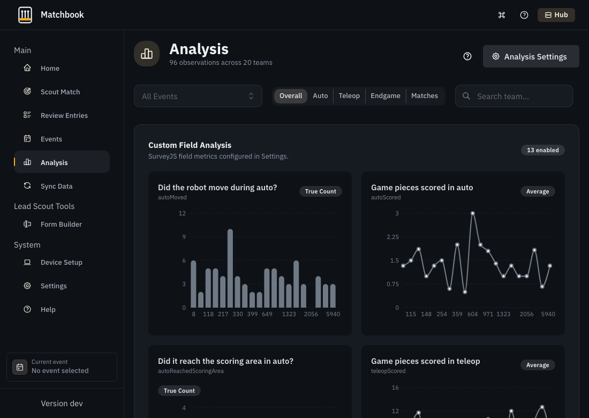
*Example practice data. Choose a metric, then select teams to compare.*

1. Open **Analysis** in the left menu.
2. Check the **Event**. Your current event is selected automatically.
3. Choose **Rank teams by** to compare a phase total or an answer from your scouting form. Numeric and yes/no answers are available automatically.
4. Check two to four teams, then press **Compare selected** to see their values together.
5. Open a team number to review its matches, full scout notes, and original form answers.
6. Use **Find a team** or **Only teams with 3+ matches** to narrow the list. **Reset filters** restores the full list for the event.

> **Tip:** Check the Matches column before judging a team. Missing answers are excluded, and phase totals are recorded activity counts rather than official game points.

### 6. Back up your data

A saved copy, kept somewhere other than this laptop.

*Save everything as a file.*

1. Open **Sync Data**, then **File**.
2. Choose **Everything on this laptop (a backup)** and press **Save file**.
3. Copy the file to a USB stick or a cloud drive.

> **Tip:** Do this every few matches and at the end of each day. After the event, save one more backup **before** using **Advanced, Delete all scouting entries**.

## Something is not working

### It says there is no scouting form.

The form comes from the lead scout. Follow **Get the scouting form** in the scouts’ guide.

The lead scout must have pressed **Save Form** in **Form Builder** first.

### My matches are not showing.

On the **Scout Match** screen, press **Get latest** on the **Your matches** card. You need to be on the same Wi-Fi as the lead scout, and they need to have pressed **Start receiving**.

If it asks **Which scout are you?**, press your name. If your name is not there, type it in **Device Setup** and press **Send my entries**.

The lead scout also has to have pressed **Fill open stations** in **Scout Assignments**.

### A scout sent entries, but I do not see all of them in Review Entries.

Review Entries starts on the event you are on, and hides entries saved under another event. A yellow notice at the top says how many are hidden. Press **Show all events** to see them.

Entries saved with no event happen when a scout had not picked their event. Press **File under** your event to move them there, and ask that scout to pick their event on the **Scout Match** screen.

### I can’t find the lead scout’s laptop in the list.

Check these three things, in order:

**1.** Is your laptop on the same Wi-Fi as the lead scout’s? Being on a different network is the most common reason.

**2.** Has the lead scout pressed **Start receiving**? Their screen must say **Receiving**.

**3.** Some venue Wi-Fi networks stop laptops from seeing each other. Use a phone hotspot, or a small travel router just for your team.

Still stuck? Use **Scan the lead scout’s code instead**, or send with **QR codes** or a **File**. They work with no Wi-Fi.

### It says the code does not match.

Check the code on the lead scout’s screen. It is 8 letters and numbers, like GRGB 5VDW.

Codes never use the letters **I** and **O** or the numbers **0** and **1**, so they cannot be mixed up. If the lead scout made a new code, use the new one.

### The camera will not start.

**On a Mac:** open **System Settings**, then **Privacy & Security**, then **Camera**, and switch **Matchbook** on. Then close and reopen Matchbook.

**On Windows:** open **Settings**, then **Privacy & security**, then **Camera**, and turn on **Let desktop apps access your camera**.

If another app is using the camera (Zoom, Teams, Photo Booth), close it.

### The QR codes will not read.

Turn the sending screen’s brightness all the way up.

Move the laptops a little closer or farther apart until the camera picture shows the whole code.

Avoid glare on either screen, and keep both laptops still.

On the sending screen, choose **Bigger squares**. The codes get simpler and easier to read.

### A message is covering a button.

Messages fade away on their own after a few seconds, and you can click right through them.

Press **Esc** to clear all messages at once.

### The window is too big for my screen, or buttons are cut off.

Matchbook fits itself to your screen. If everything still looks too large, make it smaller: hold **Ctrl** (Windows) or **Command** (Mac) and press **-** a couple of times. Press **Ctrl** or **Command** and **0** to go back to normal.

In a narrow window, the menu hides behind the **☰** button at the top left.

### Windows asked about a firewall.

Choose **Allow access** for **Private networks**. This lets the scouts’ laptops reach the lead scout’s laptop. It does not open anything to the internet.

### Did I lose my entries?

Every entry you save is stored on the laptop right away. Closing Matchbook, or closing the laptop, does not delete it.

Open **Review Entries** to see them. To be extra safe, save a backup file every few matches (**Sync Data**, then **File**).

### Matchbook says there is an update.

You can ignore it during an event. Matchbook never installs anything by itself.

Update between events, when you have internet, and make sure every laptop ends up on the same version.

## Words we use

- **Lead scout**: The one laptop that collects everyone’s scouting and helps decide who to pick. Matchbook also calls it the hub.
- **Scout**: A laptop used to watch matches and record what the robots do.
- **Entry**: Everything you recorded about one robot in one match.
- **Form**: The list of questions you answer for every entry.
- **Sync**: Moving entries, or the form, from one laptop to another.
- **QR code**: A square picture that holds data. One laptop shows it and another reads it with its camera.
- **Hotspot**: Wi-Fi shared from a phone. Good for a team that wants its own network at an event.
- **Backup**: A saved copy of your data, kept somewhere other than this laptop.
- **Event**: One competition, like the San Diego Regional.
- **Roster**: The list of scouts the lead scout can give matches to.
- **Station**: One robot in a match: Red 1, 2 or 3, or Blue 1, 2 or 3.
